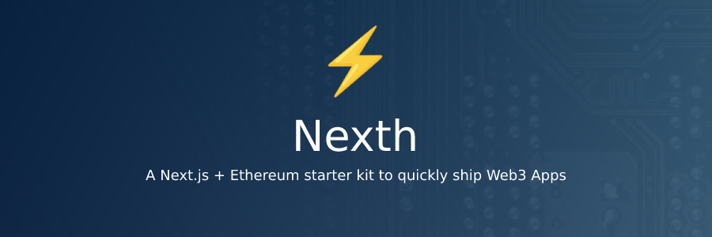

# Workation Connect Platform

## Description

**Workation Connect** is a decentralized platform that enables people on workations (working vacations) in different cities to connect, communicate, and share experiences using a Web3 technology stack. The platform hosts city-based servers where groups of people located in a specific city can join, interact, and collaborate while enjoying their workation.

## Key Features

### 1. **Decentralized City Servers** 
- Users can host or join city-based servers.
- A server acts as a community hub for everyone on a workation in a specific city.
- Users can share experiences, arrange meetups, and collaborate on projects within a server.

### 2. **Web3 Integration**
- User identities are managed securely and transparently using blockchain technology.
- Cryptographic tokens could potentially be used for in-app transactions or as a reward mechanism.
- Smart contracts ensure transparent and trustless interactions within the community.

### 3. **Real-Time Communication**
- Leveraging push protocol, users receive real-time notifications and can engage in real-time chat.
- Direct and group messaging options for seamless communication.
- Users can create and join topic-based channels within a city server.

### 4. **Experience Sharing**
- Users can post about their experiences, reviews, and tips related to local amenities, workspaces, and leisure activities.
- Visual content (photos and videos) support for enhanced sharing.
- Engage with posts via comments, likes, and shares.

## Technology Stack

### Web3
- **Blockchain**: To manage decentralized user identities, and potentially handle in-platform token transactions.
- **Smart Contracts**: For transparent and secure interactions and transactions within the platform.
- **IPFS**: For decentralized storage of data and media files, ensuring data persistence and availability without relying on centralized servers.

### Communication Protocol
- **Push Protocol**: For real-time, bidirectional communication to support chat functionality and instant notifications.
  
### Frontend
- **React**: For building a user-friendly interface.
- **Web3.js or Ethers.js**: To interact with blockchain and manage user wallets.
- **Socket.IO**: To manage real-time web socket communication for chat and notifications.

### Backend
- **Node.js**: To handle server-side logic.
- **Express**: For creating the API.
- **OrbitDB**: As a serverless, distributed, peer-to-peer database that uses IPFS as its data storage and runs on top of Ethereum blockchain for managing identities.

## User Workflow

1. **Server Creation/Joining**
   - User can create a new city server or join an existing one.
   - The creation and management of servers are done through smart contracts.
   
2. **Profile Management**
   - Users manage their profiles using decentralized identity management.
   - Profiles contain information about their professional skills, interests, and workation durations.

3. **Communication**
   - Users can post updates, share experiences, and communicate via real-time chat within a city server.
   - They can join channels, send direct messages, and get notifications about new messages, events, and updates.

4. **Experience & Knowledge Sharing**
   - Users can create posts, share images, and videos about their experiences.
   - They can provide tips, advice, and recommendations related to working and living in the city.

5. **Meetups & Events**
   - Users can create, find, and join local meetups and events.
   - RSVP to events, communicate with event organizers, and provide feedback post-event.

## Development Milestones

### Milestone 1: Proof of Concept
- Develop smart contracts for server creation and management.
- Implement basic chat functionality using push protocol.

### Milestone 2: MVP Development
- Build basic UI/UX for server creation, chatting, and post-sharing.
- Develop smart contracts for profile management and interactions.

### Milestone 3: Beta Release
- Implement and test all core features.
- Initiate beta testing with select users.

### Milestone 4: Official Release
- Address feedback from beta testing.
- Launch the platform to the public.

### Milestone 5: Feature Enhancements
- Incorporate feedback from the larger user base.
- Develop and release new features and improvements.

## Contribution

Developers, designers, and enthusiasts are welcome to contribute to the **Workation Connect** platform. Please ensure to adhere to the contribution guidelines and code of conduct.

---

This README provides a foundational outline for the Workation Connect platform. Depending on the feedback and evolution of the project, adjustments and additional features may be incorporated to enhance the user experience and functionalities. Remember to adapt the technology stack and features according to the specific needs and challenges encountered during the development process.


# Nexth

A Next.js + Ethereum starter kit to quickly ship Web3 Apps ⚡



## Packages 📦

- [App](./packages/app) - Next.js 13, with App router
- [Contracts](./packages/contracts/) - Hardhat projects

## Development 🛠️

```bash
npm run dev
# or
yarn dev
```

## Deploy on Vercel 🚢

[](https://vercel.com/new/clone?repository-url=https%3A%2F%2Fgithub.com%2Fwslyvh%2Fnexth)

The easiest way to deploy your Next.js app is to use the [Vercel Platform](https://vercel.com/new?utm_medium=nexth&filter=next.js&utm_source=nexth&utm_campaign=nexth-readme) from the creators of Next.js.

Check out our [Next.js deployment documentation](https://nextjs.org/docs/deployment) for more details.
